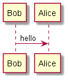
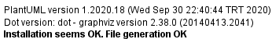

This is a personal reference repository for PlantUML, with all the examples in PlantUML Language Reference Guide. Feel free to use it, fork it, or send pull requests to update the examples.

## PlantUML

PlantUML is an open source project that allows you to create UML diagrams, by using a simple and intuitive text language. It uses GraphViz software to draw its diagrams. Images can be generated in PNG, in SVG or in LaTeX format.

## Links

* [PlantUML](https://plantuml.com/)
* [VS Code extension](https://marketplace.visualstudio.com/items?itemName=jebbs.plantuml) - highly recommended

## Versions

* PlantUML: 1.2020.18
* GraphViz: 2.38.0
* Language Reference Guide: 1.2019.9
* VS Code extension: 2.13.14

You can find the [current guide](./_Docs/PlantUML_Language_Reference_Guide_en%20-%201.2019.9.pdf) under "_Docs" folder.

## Sanity checks

After installing PlantUML & GraphViz tools, you can test them by creating the diagrams under "_Docs" folder.

Hello.puml should draw the following diagram:

GraphViz.puml should draw "Installation seems OK. File generation OK" message:

## Remarks

* To be able draw "Math" formulas (examples under Chapter 13)
  * Download the additional [JLatexMath support jars](http://beta.plantuml.net/plantuml-jlatexmath.zip) from PlantUML website
  * Unzip the extra jars into the same directory as plantuml.jar

* If a `function` has no return value, I had to change it to a `procedure` throughout the examples.

## Contact

If you have any feedback, feel free to reach me on [Twitter](https://twitter.com/coni2k) or [LinkedIn](https://www.linkedin.com/in/serkanholat/).

## License

This repository is licensed under [MIT license](/LICENSE).

You are allowed to freely use, modify and distribute this repository for any activity.
